# Machine Learning - Andrew Ng

[TOC]

## 1.简介 Introduce

### 1.1 什么是机器学习 What is the Machine Learning

- **Arthur Samuel (1952):** 

  The field of study that gives computers the ability to learn without being explicitly programmed.

- **Tom Mitchell (1998):**

  A computer program is said to learn from experience E with respect to some class of tasks T and performance measure P, if its performance at tasks in T, as measured by P, improves with experience E.

  Example: playing checkers.

  E = the experience of playing many games of checkers

  T = the task of playing checkers.

  P = the probability that the program will win the next game.

In general, any machine learning problem can be assigned to one of two broad classifications:

> Supervised learning and Unsupervised learning.


### 1.2 监督学习 Supervised Learning

- We are given a data set and already know what our correct output should look like, having the idea that there is a relationship between the input and the output.

> 监督学习：给定一些数据集（已知哪些是良性的，哪些是恶性的），去预测更多正确的数据

> 总结: Input to Output, A to B, 一种映射关系

#### 1.2.1 回归 Regression

Predict results within a ==continuous output==

#### 1.2.2 分类 Classification

Predict results in a ==discrete output==


### 1.3 无监督学习 Unsupervised Learning

- Unsupervised learning allows us to approach problems with little or no idea what our results should look like. We can derive structure from data where we don't necessarily know the effect of the variables.

- We can derive this structure by clustering the data based on relationships among the variables in the data.

- With unsupervised learning there is no feedback based on the prediction results.

> 无监督学习：给定一些数据集（不知道任何关于数据的属性），自动对数据进行聚类或分离

#### 1.3.1 聚类 Clustering

Take a collection of 1,000,000 different genes, and find a way to automatically group these genes into groups that are somehow similar or related by different variables, such as lifespan, location, roles, and so on.

#### 1.3.2 分离 Non-clustering

The "Cocktail Party Algorithm", allows you to find structure in a chaotic environment. (i.e. identifying individual voices and music from a mesh of sounds at a "cocktail party".


## 2.单变量线性回归 Linear Regression With One Variable 

### 2.1 模型表示 Model repersentation

- **hypothesis function:**

$$
h_θ(x)=θ_0+θ_1x
$$

- **cost function:**

$$
J(θ_0，θ_1）=\frac{1}{2m}\sum_{i=1}^{m}(h_\theta(x_i)-y_i)^2
$$

> "Squared error function" 平方误差函数  通常用来衡量大部分回归问题假设函数的准确性

- Goal:

$$
minimize J(\theta_0, \theta_1)
$$

> 代价函数取得最小值时的参数θ0和θ1，代入假设函数后与训练集中的点拟合程度最高


### 2.2 梯度下降法 Gradient descent

The gradient descent algorithm is:

repeat until convergence:{
$$
\theta_j:=\theta_j-\alpha\frac {\partial  } {\partial \theta_j }J(\theta_0,\cdots,\theta_n)
$$
}

where:

j = 0,1,···,n = Represents the feature index number.

α = Learning rate  // step size 一步有多大

> ==Simultaneously update== the parameters *θ1,θ2,···,θn*

> 梯度下降算法得到的是**局部最优解**

> "Batch Gradient descent" 批量梯度下降法 : Each step of gradient descent uses ***all the training examples.***


### 2.3 单变量梯度下降法 Gradient descent for Linear Regression

线性回归中的梯度下降算法：

repeat until convergence:{
$$
{\theta_{0}}:={\theta_{0}}-a\frac{1}{m}\sum\limits_{i=1}^{m}{ \left({{h}_{\theta }}({{x}^{(i)}})-{{y}^{(i)}} \right)}
$$

$$
{\theta_{1}}:={\theta_{1}}-a\frac{1}{m}\sum\limits_{i=1}^{m}{\left( \left({{h}_{\theta }}({{x}^{(i)}})-{{y}^{(i)}} \right)\cdot {{x}^{(i)}} \right)}
$$

}


## 3.多变量线性回归 Linear Regression with Multiple Variables

### 3.1 多维特征 Multiple features

- **hypothesis function:**

$$
h_{\theta}\left( x \right)={\theta_{0}}+{\theta_{1}}{x_{1}}+{\theta_{2}}{x_{2}}+...+{\theta_{n}}{x_{n}}
$$

- **引入$x_{0}=1$，则公式转化为**:

$$
h_{\theta} \left( x \right)={\theta_{0}}{x_{0}}+{\theta_{1}}{x_{1}}+{\theta_{2}}{x_{2}}+...+{\theta_{n}}{x_{n}}
$$

- **n+1个参数和n+1个变量，进一步简化为:**

$$
h_{\theta} \left( x \right)={\theta^{T}}X
$$

- **cost function:**

$$
J( \theta)=\frac{1}{2m}\sum\limits_{i=1}^{m}{{{\left( h_{\theta} \left({x}^{\left( i \right)} \right)-{y}^{\left( i \right)} \right)}^{2}}}
$$


### 3.2 多变量梯度下降 Gradient Descent for Multiple Variables

多变量梯度下降算法：

Repeat until convergence:{
$$
\theta_j:=\theta_j-\alpha\frac {\partial  } {\partial \theta_j }J(\theta_0,\cdots,\theta_n)
$$
}

代入代价函数并求偏导：

Repeat until convergence:{
$$
{\theta_{j}}:={\theta_{j}}-a\frac{1}{m}\sum\limits_{i=1}^{m}{\left( \left({{h}_{\theta }}({{x}^{(i)}})-{{y}^{(i)}} \right)\cdot {{x}^{(i)}_j} \right)}
$$
}

代码示例：

计算代价函数
$J\left( \theta  \right)=\frac{1}{2m}\sum\limits_{i=1}^{m}{{{\left( {h_{\theta}}\left( {x^{(i)}} \right)-{y^{(i)}} \right)}^{2}}}$
其中：${h_{\theta}}\left( x \right)={\theta^{T}}X={\theta_{0}}{x_{0}}+{\theta_{1}}{x_{1}}+{\theta_{2}}{x_{2}}+...+{\theta_{n}}{x_{n}}$

**Python** 代码：

```python
def computeCost(X, y, theta):
    inner = np.power(((X * theta.T) - y), 2)
    return np.sum(inner) / (2 * len(X))
```


### 3.3 梯度下降法I-特征缩放 Feature Scaling

- 以房价问题为例，假设我们使用两个特征，房屋的尺寸和房间的数量，尺寸的值为 0-2000平方英尺，而房间数量的值则是0-5，以两个参数分别为横纵坐标，绘制代价函数的等高线图能，看出图像会显得很扁，梯度下降算法需要非常多次的迭代才能收敛。

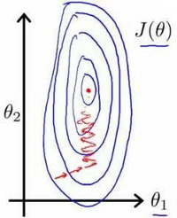

> 解决方法：将所有特征的尺度都尽量缩放到-1到1之间，实际上-3到3，或是-1/3到1/3之间都是OK的

如图：

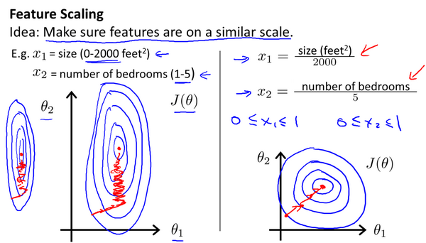

最简单的方法是令特征：
$$
{{x}_{n}}=\frac{{{x}_{n}}-{{\mu}_{n}}}{{{s}_{n}}}
$$
其中 ${\mu_{n}}$是平均值，${s_{n}}$是范围。

> 总结：Feature Scaling 即在面对多个特征时，保证特征都具有相同的尺度，能让梯度下降算法更快地收敛，需要迭代的次数更少


### 3.4 梯度下降法II-学习率 Learning rate

梯度下降算法收敛所需要的迭代次数根据模型的不同而不同，我们不能提前预知。

> 可以通过绘制迭代次数和代价函数的图表来观测算法在何时趋于收敛。

如图：

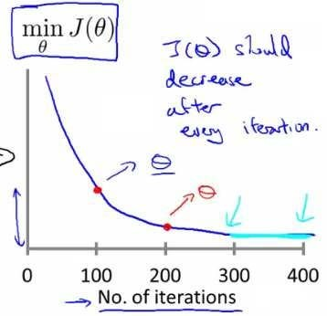

也有一些自动测试是否收敛的方法，例如将代价函数的变化值与某个阀值（例如0.001）进行比较，但通常看上面这样的图表更好。

梯度下降算法的每次迭代受到学习率的影响，如果学习率$a$过小，则达到收敛所需的迭代次数会非常高；如果学习率$a$过大，每次迭代可能不会减小代价函数，可能会反复横跳，可能会越过局部最小值导致无法收敛。

通常可以考虑尝试些学习率，并画出迭代次数和代价函数的关系曲线图分析：

$\alpha=0.0001, 0.0003, 0.001, 0.003, 0.01, 0.03, 0.1, 0.3, 1$


### 3.5 特征和多项式回归 Polynomial Regression

- 在进行数据操作前需要选取合适的特征
- 通常我们需要先观察数据然后再决定准备尝试怎样的模型


> 采用多项式回归模型时，在运行梯度下降算法前，==特征缩放==非常有必要。


### 3.6 正规方程法 Normal Equation

- 正规方程法是通过求解下面的方程来找出使得代价函数最小的参数：

$$
\frac{\partial}{\partial{\theta_{j}}}J\left( {\theta_{j}} \right)=0
$$

假设我们的==训练集特征矩阵为 $X$==（包含了 ${{x}_{0}}=1$）并且我们的==训练集结果为向量 $y$==

则可利用正规方程解出向量$\theta$：
$$
\theta ={{\left( {X^T}X \right)}^{-1}}{X^{T}}y
$$

- 以下表示数据为例：


- 标准方程法的**python**实现：

```python
import numpy as np
    
 def normalEqn(X, y):
    
   theta = np.linalg.inv(X.T@X)@X.T@y #X.T@X等价于X.T.dot(X)
    
   return theta
```

----

**$\theta ={{\left( {X^{T}}X \right)}^{-1}}{X^{T}}y$ 的推导过程：**

$J\left( \theta  \right)=\frac{1}{2m}\sum\limits_{i=1}^{m}{{{\left( {h_{\theta}}\left( {x^{(i)}} \right)-{y^{(i)}} \right)}^{2}}}$
其中：${h_{\theta}}\left( x \right)={\theta^{T}}X={\theta_{0}}{x_{0}}+{\theta_{1}}{x_{1}}+{\theta_{2}}{x_{2}}+...+{\theta_{n}}{x_{n}}$

将向量表达形式转为矩阵表达形式，则有$J(\theta )=\frac{1}{2}{{\left( X\theta -y\right)}^{2}}$ ，其中$X$为$m$行$n$列的矩阵（$m$为样本个数，$n$为特征个数），$\theta$为$n$行1列的矩阵，$y$为$m$行1列的矩阵，对$J(\theta )$进行如下变换

$J(\theta )=\frac{1}{2}{{\left( X\theta -y\right)}^{T}}\left( X\theta -y \right)$

​     $=\frac{1}{2}\left( {{\theta }^{T}}{{X}^{T}}-{{y}^{T}} \right)\left(X\theta -y \right)$

​     $=\frac{1}{2}\left( {{\theta }^{T}}{{X}^{T}}X\theta -{{\theta}^{T}}{{X}^{T}}y-{{y}^{T}}X\theta -{{y}^{T}}y \right)$

接下来对$J(\theta )$偏导，需要用到以下几个矩阵的求导法则:

$\frac{dAB}{dB}={{A}^{T}}$ 

$\frac{d{{X}^{T}}AX}{dX}=2AX$                            

所以有:

$\frac{\partial J\left( \theta  \right)}{\partial \theta }=\frac{1}{2}\left(2{{X}^{T}}X\theta -{{X}^{T}}y -{}({{y}^{T}}X )^{T}-0 \right)$

$=\frac{1}{2}\left(2{{X}^{T}}X\theta -{{X}^{T}}y -{{X}^{T}}y -0 \right)$

​           $={{X}^{T}}X\theta -{{X}^{T}}y$

令$\frac{\partial J\left( \theta  \right)}{\partial \theta }=0$,

则有$\theta ={{\left( {X^{T}}X \right)}^{-1}}{X^{T}}y$

----


### 3.7 正规方程不可逆性 Normal Equation Noninvertibility

==**${X^T}X$不可逆的情况很少，不应过多关注**==

**若${X^T}X$不可逆考虑两个因素**

1. 有线性相关的特征（行列式为0，不可逆）

2. 特征过多的时候（e.g. 10个样本，100个特征）


### 3.8 线性回归求解方法总结

- **线性回归有两种通用方法：**
  1. 梯度下降法
  2. 正规方程法

> 总结：其本质都是找到合适的参数$\theta$，使代价函数最小化


- 梯度下降法与标准方程法的比较：

| 梯度下降                      | 标准方程法                                                   |
| :---------------------------- | ------------------------------------------------------------ |
| 需要选择学习率$\alpha$        | 不需要                                                       |
| 需要多次迭代                  | 一次运算得出                                                 |
| 当特征数量$n$大时也能较好适用 | 需要计算${{\left( {{X}^{T}}X \right)}^{-1}}$ 如果特征数量n较大则运算代价大，因为矩阵逆的计算时间复杂度为$O\left( {{n}^{3}} \right)$，通常来说当$n$小于10000时还是可以接受的 |
| 适用于各种类型的模型          | 只适用于线性模型，不适合逻辑回归模型等其他模型               |
| 得到的是==局部==最优解        | 得到的是==全局==最优解                                       |

>总结：在n小于10000的线性模型中，使用标准方程法更佳


## 4.逻辑回归 Logistic Regression

- 逻辑回归是一种分类算法，输出值为0或1


### 4.1 假设函数 Hypothesis function

- 逻辑回归模型的假设函数是： 
  $$
  h_\theta \left( x \right)=g\left(\theta^{T}X \right)
  $$

- $X$ 代表特征向量

- $g$ 代表逻辑函数（**logistic function**)，也称**S**形函数（**Sigmoid function**）:
  $$
  g\left( z \right)=\frac{1}{1+{{e}^{-z}}}
  $$

- 该函数的图像为：

  

- **python**代码实现：

  ```python
  import numpy as np
      
  def sigmoid(z):
      
     return 1 / (1 + np.exp(-z))
  ```

> 逻辑回归的假设函数表示的是概率，比如$h_\theta \left( x \right)=P\left( y=1|x;\theta \right)$表示在设定参数x、θ的情况下,y = 1发生的概率


### 4.2 决策边界 Decision Boundary

- 在逻辑回归中，我们预测：


​	当${h_\theta}\left( x \right)>=0.5$时，预测 $y=1$。

​	当${h_\theta}\left( x \right)<0.5$时，预测 $y=0$ 。

​	根据上面绘制出的 **S** 形函数图像，我们知道当

​	$z=0$ 时 $g(z)=0.5$

​	$z>0$ 时 $g(z)>0.5$

​	$	z<0$ 时 $g(z)<0.5$

​	又 $z={\theta^{T}}x$ ，即：

​	${\theta^{T}}x>=0$  时，预测 $y=1$

​	${\theta^{T}}x<0$  时，预测 $y=0$


- 现在假设我们有一个模型，已知参数$\theta$ 是向量[-3 1 1]:

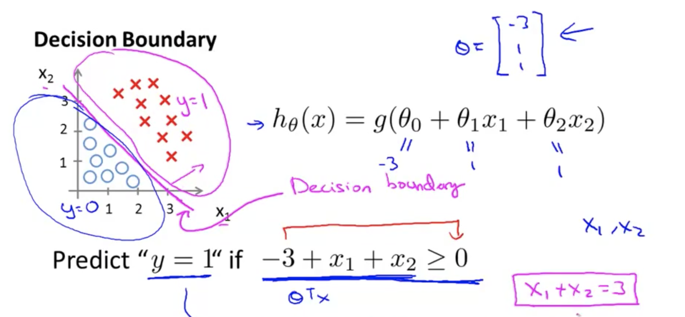

那么当$-3+{x_1}+{x_2} \geq 0$，即${x_1}+{x_2} \geq 3$时，模型将预测 $y=1$。

绘制直线${x_1}+{x_2} = 3$，这条线便是我们模型的分界线，将预测为1的区域和预测为 0的区域分隔开。


- 也可以绘制非线性的边界：


> 总结：决策边界是假设函数的一个属性，决定于其参数θ，与训练集无关


### 4.3 代价函数 Cost Function

- 对于线性回归模型，我们定义的代价函数是所有模型误差的平方和：

$$
J\left( \theta  \right)=\frac{1}{m}\sum\limits_{i=1}^{m}{\frac{1}{2}{{\left( {h_\theta}\left({x}^{\left( i \right)} \right)-{y}^{\left( i \right)} \right)}^{2}}}
$$

- 也可以表示为:

$$
J\left( \theta  \right)=\frac{1}{m}\sum\limits_{i=1}^{m}{{Cost}\left( {h_\theta}\left( {x}^{\left( i \right)} \right),{y}^{\left( i \right)} \right)}
$$

- 理论上来说，我们也可以对逻辑回归模型沿用这个定义，但是问题在于，当我们将${h_\theta}\left( x \right)=\frac{1}{1+{e^{-\theta^{T}x}}}$带入到这样定义了的代价函数中时，我们得到的代价函数将是一个非凸函数（**non-convexfunction**）

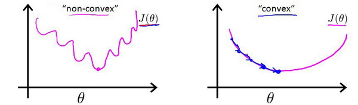

- 这意味着我们的==代价函数有许多局部最小值==，这将影响梯度下降算法寻找全局最小值


- 因此重新定义逻辑回归的代价函数$J\left( \theta  \right)=\frac{1}{m}\sum\limits_{i=1}^{m}{{Cost}\left( {h_\theta}\left( {x}^{\left( i \right)} \right),{y}^{\left( i \right)} \right)}$，其中


- ${h_\theta}\left( x \right)$与 $Cost\left( {h_\theta}\left( x \right),y \right)$之间的关系如下图所示：


> 实际 y = 1 时，当假设函数也为1，那么代价函数就是0，当假设为0，代价无限大


### 4.4 简化的代价函数和梯度下降 Simplified Cost Function and Gradient Descent

- 这是逻辑回归的代价函数：


- 可将代价函数作简化：

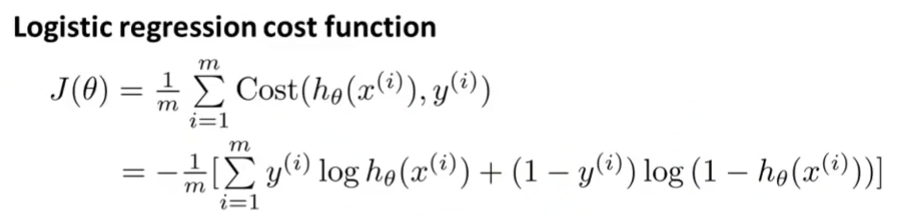

- python代码实现：

```python
import numpy as np
    
def Logistic_cost(theta, X, y):
  // 转化为矩阵
  theta = np.matrix(theta)
  X = np.matrix(X)
  y = np.matrix(y)
  // 矩阵乘法
  first = np.multiply(-y, np.log(sigmoid(X* theta.T)))
  second = np.multiply((1 - y), np.log(1 - sigmoid(X* theta.T)))
  return np.sum(first - second) / (len(X))
```

- 此时的代价函数为凸函数，可应用梯度下降法：


- 对其求偏导后得到的表达式同线性回归中的梯度下降法：


> 总结：区别在于假设函数${h_\theta}\left( x \right)$是不同的


- 对于==线性回归==假设函数：

$$
{h_\theta}\left( x \right)={\theta^T}X={\theta_{0}}{x_{0}}+{\theta_{1}}{x_{1}}+{\theta_{2}}{x_{2}}+...+{\theta_{n}}{x_{n}}
$$


- 对于==逻辑回归==假设函数：

$$
{h_\theta}\left( x \right)=\frac{1}{1+{{e}^{-{\theta^T}X}}}
$$

> 另外：对于逻辑回归，特征缩放同样适用，可以加快梯度下降法的收敛速度


### 4.5 高级优化

- 对于计算代价函数的最小值，并不一定要用梯度下降算法：


- 其余令代价函数最小的算法有：**共轭梯度**（**Conjugate Gradient**），**局部优化法**(**Broyden fletcher goldfarb shann,BFGS**)和**有限内存局部优化法**(**LBFGS**) 

  这类算法的特点有：

  1. 不需要手动选择学习率，他们可以自动选择，甚至每次迭代时的学习率都不同
  2. 通常比梯度下降算法更快
  3. 更加复杂

> 在大型机器学习项目中，在很多特征的情况下，选用高级算法


### 4.6 多类别分类 Multiclass Classification One-vs-all

- 使用逻辑回归 (**logistic regression**)来解决多类别分类问题，即"一对多" (**one-vs-all**) 分类算法


将多个类中的一个类标记为正向类（$y=1$），然后将其他所有类都标记为负向类，这个模型记作$h_\theta^{\left( 1 \right)}\left( x \right)$接着，类似地第我们选择另一个类标记为正向类（$y=2$），再将其它类都标记为负向类，将这个模型记作 $h_\theta^{\left( 2 \right)}\left( x \right)$

依此类推,最后我们得到一系列的模型简记为：
$$
h_\theta^{\left( i \right)}\left( x \right)=p\left( y=i|x;\theta  \right)
$$
其中：$i=\left( 1,2,3....k \right)$ 

最后，在我们需要做预测时，我们将所有的分类机都运行一遍，然后对每一个输入变量 $x$，选择一个让 $h_\theta^{\left( i \right)}\left( x \right)$ 最大的$ i$，即$\mathop{\max}\limits_i\,h_\theta^{\left( i \right)}\left( x \right)$。


## 5.正则化 Reqularization

### 5.1 过拟合问题 The Problem of Overfitting

以回归及分类问题举例：


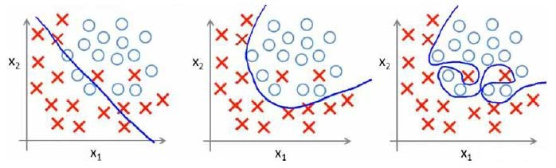

- 第一个模型欠拟合(underfitting),或者称为高偏差(High bias)
- 第三个模型过拟合(overfitting),或者称为高方差(High variance), 有很多的特征，过于强调拟合数据，而丢失了算法的本质：预测新数据，丢失算法的泛化能力(generalize)


- **如何处理过拟合问题？**

1. 丢弃一些不能帮助我们正确预测的特征。可以是手工选择保留哪些特征，或者使用一些模型选择的算法来帮忙（例如**PCA**）
2. 正则化。 保留所有的特征，但是减少参数的大小（**magnitude**），在拥有很多特征，且每个特征对结果都有微小的影响时很有效


### 5.2 代价函数 Cost Function

以回归问题举例：


对比2 3 可知，正是高次项导致了过拟合的发生：
$$
{h_\theta}\left( x \right)={\theta_{0}}+{\theta_{1}}{x_{1}}+{\theta_{2}}{x_{2}^2}+{\theta_{3}}{x_{3}^3}+{\theta_{4}}{x_{4}^4}
$$
所以如果我们能让这些高次项的系数${\theta_{3}}$和${\theta_{4}}$接近于0的话，我们就能很好的拟合了，要做的就是对系数${\theta_{3}}$和${\theta_{4}}$设置惩罚因子：
$$
\underset{\theta }{\mathop{\min }}\,\frac{1}{2m}[\sum\limits_{i=1}^{m}{{{\left( {{h}_{\theta }}\left( {{x}^{(i)}} \right)-{{y}^{(i)}} \right)}^{2}}+1000\theta _{3}^{2}+10000\theta _{4}^{2}]}
$$
此时为了让代价函数最小，${\theta_{3}}$和${\theta_{4}}$便接近0了

> 正则化的基本方法就是在一定程度上减小参数$\theta $的值


假如有非常多的特征，不知道该对哪个$\theta $进行惩罚，便对所有$\theta $都进行惩罚


**==可得正则化的代价函数：==**
$$
J\left( \theta  \right)=\frac{1}{2m}[\sum\limits_{i=1}^{m}{{{({h_\theta}({{x}^{(i)}})-{{y}^{(i)}})}^{2}}+\lambda \sum\limits_{j=1}^{n}{\theta_{j}^{2}}]}
$$

- 其中$\lambda $又称为正则化参数（**Regularization Parameter**）
- 传统上不加上$\theta_0 $，从$\theta_1 $开始进行正则化
- 当$\lambda $过大时，参数$\theta $都为0，则会造成欠拟合的现象，如下图红线


### 5.3 正则化线性回归 Regularized Linear Regression

#### 5.3.1 正则化梯度下降求解

正则化线性回归的代价函数为：

$$
J\left( \theta  \right)=\frac{1}{2m}\sum\limits_{i=1}^{m}{[({{({h_\theta}({{x}^{(i)}})-{{y}^{(i)}})}^{2}}+\lambda \sum\limits_{j=1}^{n}{\theta _{j}^{2}})]}
$$
如果我们要使用梯度下降法令这个代价函数最小化，因为我们未对$\theta_0$进行正则化，所以梯度下降算法将分两种情形：

$Repeat$  $until$  $convergence${

​                                                   ${\theta_0}:={\theta_0}-a\frac{1}{m}\sum\limits_{i=1}^{m}{(({h_\theta}({{x}^{(i)}})-{{y}^{(i)}})x_{0}^{(i)}})$ 

​                                                   ${\theta_j}:={\theta_j}-a[\frac{1}{m}\sum\limits_{i=1}^{m}{(({h_\theta}({{x}^{(i)}})-{{y}^{(i)}})x_{j}^{\left( i \right)}}+\frac{\lambda }{m}{\theta_j}]$ 

​                                                             $for$ $j=1,2,...n$

​                                                   }

对上面的算法中$ j=1,2,...,n$ 时的更新式子进行调整可得：

$$
{\theta_j}:={\theta_j}(1-a\frac{\lambda }{m})-a\frac{1}{m}\sum\limits_{i=1}^{m}{({h_\theta}({{x}^{(i)}})-{{y}^{(i)}})x_{j}^{\left( i \right)}}
$$
可以看出，正则化线性回归的梯度下降算法的变化在于，每次都在原有算法更新规则的基础上令$\theta $值乘上一个小于1的数，也许是0.99。

==所以正则化线性回归的梯度下降算法：==

$Repeat$  $until$  $convergence${

​                                                   ${\theta_0}:={\theta_0}-a\frac{1}{m}\sum\limits_{i=1}^{m}{(({h_\theta}({{x}^{(i)}})-{{y}^{(i)}})x_{0}^{(i)}})$ 

​                                                   ${\theta_j}:={\theta_j}(1-a\frac{\lambda }{m})-a\frac{1}{m}\sum\limits_{i=1}^{m}{({h_\theta}({{x}^{(i)}})-{{y}^{(i)}})x_{j}^{\left( i \right)}}$ 

​                                                             $for$ $j=1,2,...n$

​                                                   }


#### 5.3.2 正则化正规方程法

相比于正规方程法，正则化的求解需要添加一项：


图中的矩阵尺寸为 $(n+1)*(n+1)$


其不可逆问题如下图：

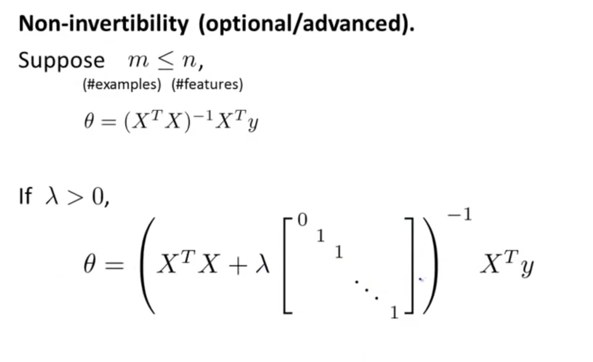

> 对于正则化正规方程法而言，只要$\lambda$大于0，则必定可逆


### 5.4 正则化逻辑回归 Regularized Logistic Regression

正则化逻辑回归的代价函数为：

$$
J\left( \theta  \right)=\frac{1}{m}\sum\limits_{i=1}^{m}{[-{{y}^{(i)}}\log \left( {h_\theta}\left( {{x}^{(i)}} \right) \right)-\left( 1-{{y}^{(i)}} \right)\log \left( 1-{h_\theta}\left( {{x}^{(i)}} \right) \right)]}+\frac{\lambda }{2m}\sum\limits_{j=1}^{n}{\theta _{j}^{2}}
$$
**Python**代码：

```python
import numpy as np

def costReg(theta, X, y, learningRate):
    theta = np.matrix(theta)
    X = np.matrix(X)
    y = np.matrix(y)
    first = np.multiply(-y, np.log(sigmoid(X*theta.T)))
    second = np.multiply((1 - y), np.log(1 - sigmoid(X*theta.T)))
    reg = (learningRate / (2 * len(X))* np.sum(np.power(theta[:,1:theta.shape[1]],2))
    return np.sum(first - second) / (len(X)) + reg
```

要最小化该代价函数，通过求导，得出梯度下降算法为：

$Repeat$  $until$  $convergence${

​                                                   ${\theta_0}:={\theta_0}-a\frac{1}{m}\sum\limits_{i=1}^{m}{(({h_\theta}({{x}^{(i)}})-{{y}^{(i)}})x_{0}^{(i)}})$

​                                                  ${\theta_j}:={\theta_j}-a[\frac{1}{m}\sum\limits_{i=1}^{m}{({h_\theta}({{x}^{(i)}})-{{y}^{(i)}})x_{j}^{\left( i \right)}}+\frac{\lambda }{m}{\theta_j}]$

​                                                 $for$ $j=1,2,...n$

​                                                 }

注：看上去同线性回归一样，但是知道 ${h_\theta}\left( x \right)=g\left( {\theta^T}X \right)$，所以与线性回归不同。


## 6.神经网络 Neural Networks

- 适用于非线性问题，多特征问题

### 6.1 模型表示 Model Representation 

设计出了类似于神经元的神经网络，效果如下：


神经网络模型是许多逻辑单元按照不同层级组织起来的网络，每一层的输出变量都是下一层的输入变量。下图为一个3层的神经网络，第一层称为输入层（**Input Layer**），最后一层称为输出层（**Output Layer**），中间层称为隐藏层（**Hidden Layers**）。我们为每一层都增加一个偏差单位（**bias unit**），==其中$\theta$参数也称作权重==


$a_{i}^{\left( j \right)}$ 代表第$j$ 层的第 $i$ 个激活单元。${{\theta }^{\left( j \right)}}$代表从第 $j$ 层映射到第$ j+1$ 层时的权重的矩阵，例如${{\theta }^{\left( 1 \right)}}$代表从第一层映射到第二层的权重的矩阵。其尺寸为：以第 $j+1$层的激活单元数量为行数，以第 $j$ 层的激活单元数加一为列数的矩阵。例如：上图所示的神经网络中${{\theta }^{\left( 1 \right)}}$的尺寸为 3*4

我们把这样从左到右一层一层的算法称为==前向传播算法( **FORWARD PROPAGATION** )==


- 在编程时，用向量化的方法更为简便：


- 为了更好地理解神经网络：

其实神经网络就像是逻辑回归，只不过把输入变量改成中间层的$\left[ a_1^{(2)}\sim a_3^{(2)} \right]$即:  
$$
h_\theta(x)=g\left( \Theta_0^{\left( 2 \right)}a_0^{\left( 2 \right)}+\Theta_1^{\left( 2 \right)}a_1^{\left( 2 \right)}+\Theta_{2}^{\left( 2 \right)}a_{2}^{\left( 2 \right)}+\Theta_{3}^{\left( 2 \right)}a_{3}^{\left( 2 \right)} \right)
$$
$a_0, a_1, a_2, a_3$是更为高级的特征值，也就是$x_0, x_1, x_2, x_3$的进化体，并且它们是由 $x$与$\theta$决定的，因为是梯度下降的，所以$a$是变化的，并且变得越来越厉害，所以这些更高级的特征值远比仅仅将 $x$次方厉害，也能更好的预测新数据。

这就是神经网络相比于逻辑回归和线性回归的优势


### 6.2 多类分类 Multiclass Classification

当使用神经网络需要多个输出类别的时候，可以在输出层多设置神经元：


### 6.3 代价函数 Cost Function

首先引入一些便于稍后讨论的新标记方法：

假设神经网络的训练样本有$m$个，每个包含一组输入$x$和一组输出信号$y$，$L$表示神经网络层数，$S_I$表示每层的**neuron**个数($S_l$表示输出层神经元个数)，$S_L$代表最后一层中处理单元的个数。

将神经网络的分类定义为两种情况：二类分类和多类分类

二类分类：$S_L=0, y=0\, or\, 1$表示哪一类；

$K$类分类：$S_L=k, y_i = 1$表示分到第$i$类；$(k>2)$


对比逻辑回归，神经网络代价函数可表示为：


1. 将输出层累加起来
2. 正则化项改变，同样排除了$\theta_0$

这个看起来复杂很多的代价函数背后的思想还是一样的，我们希望通过代价函数来观察算法预测的结果与真实情况的误差有多大，唯一不同的是，对于每一行特征，我们都会给出$K$个预测，基本上我们可以利用循环，对每一行特征都预测$K$个不同结果，然后在利用循环在$K$个预测中选择可能性最高的一个，将其与$y$中的实际数据进行比较。

正则化的那一项只是排除了每一层$\theta_0$后，每一层的$\theta$ 矩阵的和。最里层的循环$j$循环所有的行（由$s_{l+1}$  层的激活单元数决定），循环$i$则循环所有的列，由该层（$s_l$层）的激活单元数所决定。即：$h_\theta(x)$与真实值之间的距离为每个样本-每个类输出的加和，对参数进行**regularization**的**bias**项处理所有参数的平方和。


### 6.4 反向传播算法 Backpropagation Algorithm

之前我们在计算神经网络预测结果的时候我们采用了一种正向传播方法，我们从第一层开始正向一层一层进行计算，直到最后一层的$h_{\theta}\left(x\right)$。

现在，为了计算代价函数的偏导数$\frac{\partial}{\partial\Theta^{(l)}_{ij}}J\left(\Theta\right)$，我们需要采用一种反向传播算法，也就是首先计算最后一层的误差，然后再一层一层反向求出各层的误差，直到倒数第二层。


假设我们的训练集只有一个样本$\left({x}^{(1)},{y}^{(1)}\right)$，我们的神经网络是一个四层的神经网络，其中$K=4，S_{L}=4，L=4$：

- 前向传播算法：

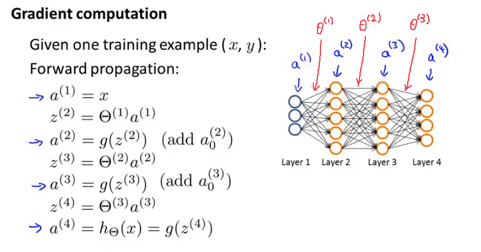

- 反向传播算法：


从后往前计算误差便是反向传播算法，而因为第一层是输入变量，不存在误差。

假设$λ=0$，即我们不做任何正则化处理时代价函数的偏导数为：
$$
\frac{\partial}{\partial\Theta_{ij}^{(l)}}J(\Theta)=a_{j}^{(l)} \delta_{i}^{l+1}
$$
其中：

$l$ 代表目前所计算的是第几层。

$j$ 代表目前计算层中的激活单元的下标，也将是下一层的第$j$个输入变量的下标。

$i$ 代表下一层中误差单元的下标，是受到权重矩阵中第$i$行影响的下一层中的误差单元的下标


- 算法可表示为：


1. 用正向传播算法计算出每一层的激活单元
2. 根据预测结果及训练集结果求出最后一层误差，利用反向传播计算至第二层所有误差
3. 之后便可计算代价函数的偏导数


### 6.5 梯度检验 Gradient Checking

- 当我们对一个较为复杂的模型（例如神经网络）使用梯度下降算法时，可能会存在一些不容易察觉的错误，意味着，虽然代价看上去在不断减小，但最终的结果可能并不是最优解。

- 为了确保我们的梯度下降算法是正确的，采取梯度的数值检验（**Numerical Gradient Checking**）来对梯度下降算法做检验


梯度检验原理如下，采用几何导数定义方法：


当$\theta$是一个向量时：


- 梯度检验的流程：


> 注意在验证梯度下降算法正确后，必须关闭梯度检验法，该算法时间复杂度相比梯度下降算法高很多


### 6.6 总结 Conclusion

- 选择神经网络的结构 - 决定多少个隐藏层，每个隐藏层各有多少神经元

  如果隐藏层数大于1，确保每个隐藏层的单元个数相同，通常情况下隐藏层单元的个数越多越好。

- 训练神经网络

  1. 参数随机初始化，不能让所有参数都为0
  2. 利用正向传播算法计算所有的$h_{\theta}(x)$
  3. 计算代价函数$J_\theta$
  4. 利用反向传播算法计算$J_\theta$的所有偏导数
  5. 使用梯度检验来检查反向传播算法的正确性
  6. 使用梯度下降或其他优化算法来$minJ_\theta$

> 反向传播算法可理解为计算梯度下降的方向


## 7.改进机器学习算法 Improve the machine learning algorithm

### 7.1 如何评估一个假设 How to Evaluating a Hypothesis

> 假设是否==欠拟合或过拟合==


为了检验算法是否过拟合，我们将数据分成训练集和测试集，通常用70%的数据作为训练集，用剩下30%的数据作为测试集。很重要的一点是训练集和测试集均要含有各种类型的数据，通常我们要对数据进行“洗牌”，然后再分成训练集和测试集。


测试集评估在通过训练集让我们的模型学习得出其参数后，对测试集运用该模型，我们有两种方式计算误差：

1. 对于线性回归模型，我们利用测试集数据计算代价函数$J$

2. 对于逻辑回归模型，我们除了可以利用测试数据集来计算代价函数外：

$$ J_{test}{(\theta)} = -\frac{1}{{m}_{test}}\sum_\limits{i=1}^{m_{test}}\log{h_{\theta}(x^{(i)}_{test})}+(1-{y^{(i)}_{test}})\log{h_{\theta}(x^{(i)}_{test})}$$

还可以根据误分类的比率，对于每一个测试集样本，计算：


然后对计算结果求平均。


### 7.2 模型选择与交叉验证集 Model Selection and Train_Validation_Test Sets

假设我们要在10个不同次数的二项式模型之间进行选择：


显然越高次数的多项式模型越能够适应我们的训练数据集，但是适应训练数据集并不代表着拥有泛化能力，所以我们需要使用交叉验证集来帮助选择模型。

即：使用60%的数据作为训练集，使用 20%的数据作为交叉验证集，使用20%的数据作为测试集


模型选择的方法为：

1. 使用训练集训练出10个模型

2. 用10个模型分别对交叉验证集计算得出交叉验证误差（代价函数的值）

3. 选取代价函数值最小的模型

4. 用步骤3中选出的模型对测试集计算得出推广误差（代价函数的值）

   ***Train/validation/test error***

   **Training error:**

$$
J_{train}(\theta) = \frac{1}{2m}\sum_\limits{i=1}^{m}(h_{\theta}(x^{(i)})-y^{(i)})^2
$$

**Cross Validation error:**

$$
J_{cv}(\theta) = \frac{1}{2m_{cv}}\sum_\limits{i=1}^{m}(h_{\theta}(x^{(i)}_{cv})-y^{(i)}_{cv})^2
$$


**Test error:**
$$
J_{test}(\theta)=\frac{1}{2m_{test}}\sum_\limits{i=1}^{m_{test}}(h_{\theta}(x^{(i)}_{cv})-y^{(i)}_{cv})^2
$$


### 7.3 诊断偏差与方差 Diagnosing Bias vs. Variance

- 评价一个算法：高偏差（欠拟合） or 高方差（过拟合）

我们通常会通过将训练集和交叉验证集的代价函数误差与多项式的次数绘制在同一张图表上来帮助分析：


**Bias/variance**

**Training error:**				               $J_{train}(\theta) = \frac{1}{2m}\sum_\limits{i=1}^{m}(h_{\theta}(x^{(i)})-y^{(i)})^2$

**Cross Validation error:**				$J_{cv}(\theta) = \frac{1}{2m_{cv}}\sum_\limits{i=1}^{m}(h_{\theta}(x^{(i)}_{cv})-y^{(i)}_{cv})^2$

对于训练集，当 $d$ 较小时，模型拟合程度更低，误差较大；随着 $d$ 的增长，拟合程度提高，误差减小。
	
对于交叉验证集，当 $d$ 较小时，模型拟合程度低，误差较大；但是随着 $d$ 的增长，误差呈现先减小后增大的趋势，==转折点是我们的模型开始过拟合训练数据集的时候==。
	
如果我们的交叉验证集误差较大，我们如何判断是方差还是偏差呢？根据上面的图表，我们知道:


训练集误差和交叉验证集误差近似时：偏差/欠拟合
	
交叉验证集误差远大于训练集误差时：方差/过拟合


### 7.4 正则化和偏差/方差 Regularization and Bias_Variance

在我们在训练模型的过程中，一般会使用一些正则化方法来防止过拟合。但是我们可能会正则化的程度太高或太小了，即我们在选择λ的值时也需要思考与刚才选择多项式模型次数类似的问题。


我们选择一系列的想要测试的 $\lambda$ 值，通常是 0-10之间的呈现2倍关系的值（如：$0,0.01,0.02,0.04,0.08,0.15,0.32,0.64,1.28,2.56,5.12,10$共12个）。 我们同样把数据分为训练集、交叉验证集和测试集。


选择$\lambda$的方法为：

1. 使用训练集训练出12个不同程度正则化的模型
2. 用12个模型分别对交叉验证集计算的出交叉验证误差
3. 选择得出交叉验证误差**最小**的模型
4. 运用步骤3中选出模型对测试集计算得出推广误差，我们也可以同时将训练集和交叉验证集模型的代价函数误差与λ的值绘制在一张图表上：


• 当 $\lambda$ 较小时，训练集误差较小（过拟合）而交叉验证集误差较大
	
• 随着 $\lambda$ 的增加，训练集误差不断增加（欠拟合），而交叉验证集误差则是先减小后增加


### ==7.5 学习曲线 Learning Curves==

- 学习曲线是学习算法的一个很好的**合理检验**（**sanity check**）
- 可以使用学习曲线来判断某一个学习算法是否处于偏差、方差问题
- 学习曲线是将训练集误差和交叉验证集误差作为训练集样本数量（$m$）的函数绘制的图表

>横坐标为：训练集学习样本数 纵坐标为：训练集和交叉验证集误差

当训练较少行数据的时候，训练的模型将能够非常完美地适应较少的训练数据，但是训练出来的模型却不能很好地适应交叉验证集数据或测试集数据。


如何利用学习曲线识别高偏差/欠拟合：作为例子，我们尝试用一条直线来适应下面的数据，可以看出，无论训练集有多么大误差都不会有太大改观：


如何利用学习曲线识别高方差/过拟合：假设我们使用一个非常高次的多项式模型，并且正则化非常小，可以看出，当交叉验证集误差远大于训练集误差时，往训练集增加更多数据可以提高模型的效果。


> 总结：
>
> 1.在高偏差/欠拟合的情况下，增加数据到训练集不一定能有帮助。
>
> 2.在高方差/过拟合的情况下，增加更多数据到训练集可能可以提高算法效果。


### 7.6 如何调整算法 How to improve the algorithm

我们已经介绍了怎样评价一个学习算法，我们讨论了模型选择问题，偏差和方差的问题。那么这些诊断法则怎样帮助我们判断，哪些方法可能有助于改进学习算法的效果，而哪些可能是徒劳的呢？

1. 获得更多的训练样本——解决高方差（过拟合）

2. 尝试减少特征的数量——解决高方差（过拟合）

3. 尝试获得更多的特征——解决高偏差（欠拟合）

4. 尝试增加多项式特征——解决高偏差（欠拟合）

5. 尝试减少正则化程度λ——解决高偏差（欠拟合）

6. 尝试增加正则化程度λ——解决高方差（过拟合）


## 8.机器学习系统设计 Machine Learning System Design

### 8.1 误差分析 Error Analysis

构建一个学习算法的推荐方法为：

1. 从一个简单的能快速实现的算法开始，实现该算法并用交叉验证集数据测试这个算法
2. 绘制学习曲线，决定是增加更多数据，或者添加更多特征，还是其他选择
3. 进行误差分析：人工检查交叉验证集中我们算法中产生预测误差的样本，看看这些样本是否有某种系统化的趋势

> 需要一个具体的误差值作为评价标准


### 8.2 类偏斜的误差度量 Error Metrics for Skewed Classes

类偏斜问题：

- 表现为我们的训练集中有非常多的同一种类的样本，只有很少或没有其他类的样本

例如我们希望用算法来预测癌症是否是恶性的，在我们的训练集中，只有0.5%的实例是恶性肿瘤。假设我们编写一个非学习而来的算法，在所有情况下都预测肿瘤是良性的，那么误差只有0.5%。然而我们通过训练而得到的神经网络算法却有1%的误差。这时，**误差的大小是不能视为评判算法效果的依据的**。

- ==**类偏斜问题采用：查准率**（**Precision**）和**查全率**（**Recall**）作为评价指标==

  我们将算法预测的结果分成四种情况：

1. **正确肯定**（**True Positive,TP**）：预测为真，实际为真
2. **正确否定**（**True Negative,TN**）：预测为假，实际为假
3. **错误肯定**（**False Positive,FP**）：预测为真，实际为假
4. **错误否定**（**False Negative,FN**）：预测为假，实际为真

查准率=**TP/(TP+FP)**。例，在所有我们预测有恶性肿瘤的病人中，实际上有恶性肿瘤的病人的百分比，越高越好。

查全率=**TP/(TP+FN)**。例，在所有实际上有恶性肿瘤的病人中，成功预测有恶性肿瘤的病人的百分比，越高越好。
	
这样，对于我们刚才那个总是预测病人肿瘤为良性的算法，其查全率是0。

|            |              | **预测值**   |             |
| ---------- | ------------ | ------------ | ----------- |
|            |              | **Positive** | **Negtive** |
| **实际值** | **Positive** | **TP**       | **FN**      |
|            | **Negtive**  | **FP**       | **TN**      |


### 8.3 查全率和查准率之间的权衡

在很多应用中，我们希望能够保证查准率和召回率的相对平衡。
	
在这节课中，我将告诉你应该怎么做，同时也向你展示一些查准率和召回率作为算法评估度量值的更有效的方式。继续沿用刚才预测肿瘤性质的例子。假使，我们的算法输出的结果在0-1 之间，我们使用阀值0.5 来预测真和假。


查准率**(Precision)=TP/(TP+FP)**
例，在所有我们预测有恶性肿瘤的病人中，实际上有恶性肿瘤的病人的百分比，越高越好。

查全率**(Recall)=TP/(TP+FN)**例，在所有实际上有恶性肿瘤的病人中，成功预测有恶性肿瘤的病人的百分比，越高越好。
	
如果我们希望只在非常确信的情况下预测为真（肿瘤为恶性），即我们希望更高的查准率，我们可以使用比0.5更大的阀值，如0.7，0.9。这样做我们会减少错误预测病人为恶性肿瘤的情况，同时却会增加未能成功预测肿瘤为恶性的情况。
	
如果我们希望提高查全率，尽可能地让所有有可能是恶性肿瘤的病人都得到进一步地检查、诊断，我们可以使用比0.5更小的阀值，如0.3。
	
我们可以将不同阀值情况下，查全率与查准率的关系绘制成图表，曲线的形状根据数据的不同而不同：

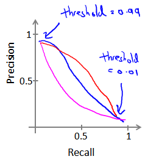

我们希望有一个帮助我们选择这个阀值的方法：

==**F1 值**（**F1 Score**）==
$$
{{F}_{1}}Score:2\frac{PR}{P+R}
$$

> F1 Score 越高，整体而言越好


### 8.4 机器学习数据量 Data For Machine Learning

大量的数据在什么时候对算法的准确率有帮助：

1. $y$ 可以根据特征值$x$被准确地预测出来
2. 在庞大的训练集中采用一个多参数/多特征的学习算法


> 此时偏差和方差都较小


## 9.支持向量机 Support Vector Machines

### 9.1 优化目标 Optimization Objective

正如我们之前开发的学习算法，我们从优化目标开始。那么，我们开始学习这个算法。为了描述支持向量机，我将会从逻辑回归开始展示我们如何一点一点修改来得到本质上的支持向量机。


现在考虑下我们想要逻辑回归做什么：如果有一个 $y=1$的样本，现在我们希望${{h}_{\theta }}\left( x \right)$ 趋近1。因为我们想要正确地将此样本分类，这就意味着当 ${{h}_{\theta }}\left( x \right)$趋近于1时，$\theta^Tx$ 应当远大于0，这是因为由于 $z$ 表示 $\theta^Tx$，当 $z$远大于0时，即到了该图的右边，你不难发现此时逻辑回归的输出将趋近于1。相反地，如果我们有另一个样本，即$y=0$。我们希望假设函数的输出值将趋近于0，这对应于$\theta^Tx$，或者就是 $z$ 会远小于0，因为对应的假设函数的输出值趋近0。


分别在y为两种情况时，使用紫红色曲线作代替，并将左边的函数称为${\cos}t_1{(z)}$，右边函数我称它为${\cos}t_0{(z)}$，对应的 $y=1$ 和 $y=0$ 的情况。

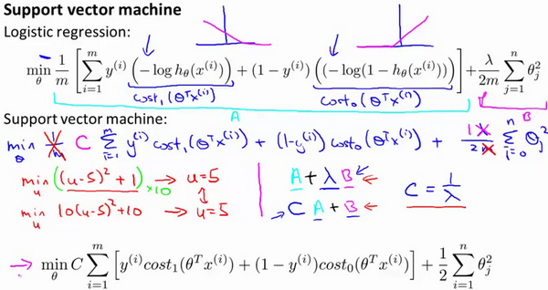

==现在，我们就开始构建支持向量机：==

1. 使用${\cos}t_1{(z)}$，${\cos}t_0{(z)}$替代原来的对数函数
2. 按照SVM惯例，删去常数$1/m$
3. 代价函数×上$\lambda$，并用惩罚系数C代替（$C = 1/\lambda$）


> 最后有别于逻辑回归输出的概率，在支持向量机中，当最小化代价函数获得参数${{\theta }}$后，==支持向量机==所做的是用它来==直接预测$y$的值等于1，还是等于0，而不是等于1的概率==


### 9.2 大间距直观理解 Large Margin Intuition

支持向量机也可看作大间距分类器：


这是支持向量机模型的代价函数，在左边这里我画出了关于$z$的代价函数${\cos}t_1{(z)}$，此函数用于正样本，而在右边这里我画出了关于$z$的代价函数${\cos}t_0{(z)}$，横轴表示$z$，现在让我们考虑一下，最小化这些代价函数的必要条件是什么。如果你有一个正样本，$y=1$，则只有在$z>=1$时，代价函数${\cos}t_1{(z)}$才等于0。

换句话说，如果你有一个正样本，我们会希望$\theta^Tx>=1$，反之，如果$y=0$，我们观察一下，函数${\cos}t_0{(z)}$，它只有在$z<=-1$的区间里函数值为0。这是支持向量机的一个有趣性质。事实上，如果你有一个正样本$y=1$，则其实我们仅仅要求$\theta^Tx$大于等于0，就能将该样本恰当分出，这是因为如果$\theta^Tx$\>0大的话，我们的模型代价函数值为0，类似地，如果你有一个负样本，则仅需要$\theta^Tx$\<=0就会将负例正确分离，但是，支持向量机的要求更高，不仅仅要能正确分开输入的样本，即不仅仅要求$\theta^Tx$\>0，我们需要的是比0值大很多，比如大于等于1，我也想这个比0小很多，比如我希望它小于等于-1，**这就相当于在支持向量机中嵌入了一个额外的安全因子，或者说安全的间距因子**。


若将这个常数$C$设置成一个非常大的值。比如我们假设$C$的值为100000或者其它非常大的数，然后来观察支持向量机会给出什么结果？


如果 $C$非常大，则最小化代价函数的时候，我们将会很希望找到一个使第一项为0的最优解，因此，让我们尝试在代价项的第一项为0的情形下理解该优化问题。比如我们可以把$C$设置成了非常大的常数，这将给我们一些关于支持向量机模型的直观感受。

我们已经看到输入一个训练样本标签为$y=1$，你想令第一项为0，你需要做的是找到一个${{\theta }}$，使得$\theta^Tx>=1$，类似地，对于一个训练样本，标签为$y=0$，为了使${\cos}t_0{(z)}$ 函数的值为0，我们需要$\theta^Tx<=-1$。

这样当你求解这个优化问题的时候，当你最小化这个关于变量${{\theta }}$的函数的时候，你会得到一个非常有趣的决策边界 - 大间距边界。


==如图中黑色决策边界，与样本之间有更大的最短距离==

事实上，支持向量机现在要比这个大间距分类器所体现得更成熟，尤其是当你使用大间距分类器的时候，你的学习算法会受异常点(outlier) 的影响。比如我们加入一个额外的正样本。


- 若将惩罚系数$C$设置的过大，对分错类的惩罚会很大，那么边界会是图中粉红色直线


### 9.3 大间距分类的数学解释 Mathematics Behind Large Margin Classification

- 对支持向量机 - 大间距分类的数学解释：


首先，让我来给大家复习一下关于向量内积的知识。假设我有两个向量，$u$和$v$，我将它们写在这里。两个都是二维向量，我们看一下，$u^T v$的结果。$u^T v$也叫做向量$u$和$v$之间的内积。由于是二维向量，我可以将它们画在这个图上。我们说，这就是向量$u$即在横轴上，取值为某个${{u}_{1}}$，而在纵轴上，高度是某个${{u}_{2}}$作为$u$的第二个分量。

$\left\| u \right\|$表示$u$的范数，即$u$的长度，即向量$u$的欧几里得长度，根据毕达哥拉斯定理：
$$
\left\| u \right\|=\sqrt{u_{1}^{2}+u_{2}^{2}}
$$
计算内积：我们将向量$v$投影到向量$u$上，我们做一个直角投影，或者说一个90度投影将其投影到$u$上，接下来我度量这条红线的长度。我称这条红线的长度为$p$，$p$是$v$投影到向量$u$上的长度：
$$
{{u}^{T}}v=p\centerdot \left\| u \right\|
$$
另一个计算公式是：$u^T v$就是$\left[ {{u}_{1}}\text{ }{{u}_{2}} \right]$ 这个一行两列的矩阵乘以$v$。因此可以得到${{u}_{1}}\times {{v}_{1}}+{{u}_{2}}\times {{v}_{2}}$。根据线性代数的知识，这两个公式会给出同样的结果。顺便说一句，$u^Tv=v^Tu$。因此如果你将$u$和$v$交换位置，将$u$投影到$v$上，而不是将$v$投影到$u$上，然后做同样地计算，只是把$u$和$v$的位置交换一下，你事实上可以得到同样的结果。申明一点，在这个等式中$u$的范数是一个实数，$p$也是一个实数，因此$u^T v$就是两个实数正常相乘。

最后一点，需要注意的就是$p$值，$p$事实上是有符号的，即它可能是正值，也可能是负值。我的意思是说，如果$u$是一个类似这样的向量，$v$是一个类似这样的向量，$u$和$v$之间的夹角大于90度，则如果将$v$投影到$u$上，会得到这样的一个投影，这是$p$的长度，在这个情形下我们仍然有${{u}^{T}}v$是等于$p$乘以$u$的范数。唯一一点不同的是$p$在这里是负的。在内积计算中，如果$u$和$v$之间的夹角小于90度，那么那条红线的长度$p$是正值。然而如果这个夹角大于90度，则$p$将会是负的。就是这个小线段的长度是负的。如果它们之间的夹角大于90度，两个向量之间的内积也是负的。这就是关于向量内积的知识。


- 接下来将会使用这些关于向量内积的性质试图来理解支持向量机中的目标函数($C$很大)

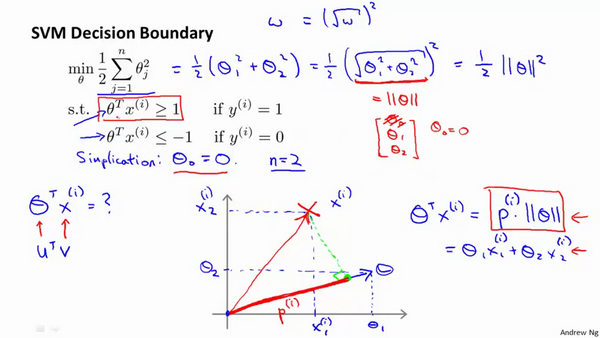

我接下来忽略掉截距，令${{\theta }_{0}}=0$，这样更容易画示意图。我将特征数$n$置为2，因此我们仅有两个特征${{x}_{1}},{{x}_{2}}$，现在我们来看一下目标函数，支持向量机的优化目标函数。当我们仅有两个特征，即$n=2$时，这个式子可以写作：
$$
\frac{1}{2}\left({\theta_1^2+\theta_2^2}\right)=\frac{1}{2}\left(\sqrt{\theta_1^2+\theta_2^2}\right)^2=\frac{1}{2}\left\| \theta \right\|^2
$$
==因此支持向量机做的全部事情，就是**极小化参数向量**${{\theta }}$**范数的平方，或者说长度的平方**==

并且，对取值范围$\theta^{T}x$用向量乘法表示可得：
$$
θ^Tx^{(i)}=p^{(i)}\cdot{\left\| \theta \right\|}
$$
==故这个$θ^Tx^{(i)}>=1$  或者$θ^Tx^{(i)}<-1$的,约束是可以被$p^{(i)}\cdot{x}>=1$这个约束所代替的==


对于这样选择的参数${{\theta }}$，可以看到参数向量${{\theta }}$事实上是和决策界是90度正交的，因此这个绿色的决策界对应着一个参数向量${{\theta }}$这个方向,顺便提一句${{\theta }_{0}}=0$的简化仅仅意味着决策界必须通过原点$(0,0)$

> 当左图选择绿色边界时，由于边界比较短，导致$p^{(i)}$较小，故为了保证$p^{(i)}\cdot{x}>=1$则$\left\| \theta \right\|$就要很大，与此同时，代价函数$\frac{1}{2}\left\| \theta \right\|^2$就会很大，要付出比较大的代价，所以SVM算法偏向于选择右图中的绿色边界，可大幅度优化代价函数


### 9.4 核函数 Kernels

回顾我们之前讨论过可以使用高级数的多项式模型来解决无法用直线进行分隔的分类问题：


为了获得上图所示的判定边界，我们的模型可能是${{\theta }_{0}}+{{\theta }_{1}}{{x}_{1}}+{{\theta }_{2}}{{x}_{2}}+{{\theta }_{3}}{{x}_{1}}{{x}_{2}}+{{\theta }_{4}}x_{1}^{2}+{{\theta }_{5}}x_{2}^{2}+\cdots $的形式。

我们可以用一系列的新的特征$f$来替换模型中的每一项。例如令：
${{f}_{1}}={{x}_{1}},{{f}_{2}}={{x}_{2}},{{f}_{3}}={{x}_{1}}{{x}_{2}},{{f}_{4}}=x_{1}^{2},{{f}_{5}}=x_{2}^{2}$

得到：
$$
h_θ(x)={{\theta }_{1}}f_1+{{\theta }_{2}}f_2+...+{{\theta }_{n}}f_n
$$
然而，除了对原有的特征进行组合以外，有没有更好的方法来构造$f_1,f_2,f_3$？


==使用带核函数的支持向量机==：

即使用通过核函数计算出的新特征$f_1,f_2,f_3$代替训练样本本身的特征$x_1，x_2，x_3$

例如高斯核函数**(**Gaussian Kernel**):
$$
{{f}_{1}}=similarity(x,{{l}^{(1)}})=e(-\frac{{{\left\| x-{{l}^{(1)}} \right\|}^{2}}}{2{{\sigma }^{2}}})
$$
其中：${{\left\| x-{{l}^{(1)}} \right\|}^{2}}=\sum{_{j=1}^{n}}{{({{x}_{j}}-l_{j}^{(1)})}^{2}}$，为实例$x$中所有特征与地标$l^{(1)}$(**landmarks**)之间的距离的和。上例中的$similarity(x,{{l}^{(1)}})$就是核函数，具体而言，这里是一个**高斯核函数**(**Gaussian Kernel**)。 

这些地标的作用是什么？如果一个训练样本$x$与地标$l$之间的距离近似于0，则新特征 $f$近似于$e^{-0}=1$，如果训练样本$x$与地标$l$之间距离较远，则$f$近似于$e^{-(一个较大的数)}=0$。


假设我们的训练样本含有两个特征[$x_{1}$ $x{_2}$]，给定地标$l^{(1)}$与不同的$\sigma$值，见下图：


图中水平面的坐标为 $x_{1}$，$x_{2}$而垂直坐标轴代表$f$。可以看出，只有当$x$与$l^{(1)}$重合时$f$才具有最大值。随着$x$的改变$f$值改变的速率受到$\sigma^2$的控制。


根据核函数计算出新的特征f，根据f来制定划分边界


- 如何选择地标？ - 根据训练集的特征选择

我们通常是根据训练集的数量选择地标的数量，即如果训练集中有$m$个样本，则我们选取$m$个地标，并且令:$l^{(1)}=x^{(1)},l^{(2)}=x^{(2)},.....,l^{(m)}=x^{(m)}$。这样做的好处在于：现在我们得到的新特征是建立在原有特征与训练集中所有其他特征之间距离的基础之上的


接下来则将核函数使用在支持向量机中，下面是高斯核函数支持向量机的两个参数$C$和$\sigma$的影响：

$C=1/\lambda$

$C$ 较大时，相当于$\lambda$较小，可能会导致过拟合，高方差；

$C$ 较小时，相当于$\lambda$较大，可能会导致低拟合，高偏差；

$\sigma$较大时，可能会导致低方差，高偏差；

$\sigma$较小时，可能会导致低偏差，高方差。


在高斯核函数之外我们还有其他一些选择，如：

多项式核函数（**Polynomial Kerne**l）

字符串核函数（**String kernel**）

卡方核函数（ **chi-square kernel**）

直方图交集核函数（**histogram intersection kernel**）

不使用核函数又称：线性核函数(**linear kernel**)


### 9.5 使用支持向量机 Using an SVM

何时使用逻辑回归，何时使用支持向量机？

**下面是一些普遍使用的准则：**

$n$为特征数，$m$为训练样本数。

(1)如果相较于$m$而言，$n$要大许多，即训练集数据量不够支持我们训练一个复杂的非线性模型，我们选用逻辑回归模型或者不带核函数的支持向量机。

(2)如果$n$较小，而且$m$大小中等，例如$n$在 1-1000 之间，而$m$在10-10000之间，使用高斯核函数的支持向量机。

(3)如果$n$较小，而$m$较大，例如$n$在1-1000之间，而$m$大于50000，则使用支持向量机会非常慢，解决方案是创造、增加更多的特征，然后使用逻辑回归或不带核函数的支持向量机。

而神经网络在以上三种情况下都可能会有较好的表现，但是训练神经网络可能非常慢

**SVM**具有的优化问题，是一种凸优化问题，其代价函数为凸函数。因此，好的**SVM**优化软件包总是会找到全局最小值，或者接近它的值。对于**SVM**你不需要担心局部最优。在实际应用中，局部最优不是**SVM**所需要解决的一个重大问题，所以这是你在使用**SVM**的时候不需要太去担心的一个问题。


## 10.聚类 Clustering

### 10.1 K均值算法 K-Means Algorithm

**K-均值**是最普及的聚类算法，算法接受一个未标记的数据集，然后将数据聚类成不同的组。


**K-均值**是一个迭代算法，假设我们想要将数据聚类成n个组，其方法为:

1. 首先选择$K$个随机的点$μ^1$,$μ^2$,...,$μ^k$ ，称为**聚类中心**（**cluster centroids**）
2. 对于数据集中的每一个数据，按照距离$K$个中心点的距离，将其与距离最近的中心点关联起来，与同一个中心点关联的所有点聚成一类，$c^{(1)}$,$c^{(2)}$,...,$c^{(m)}$ 表示聚到哪一类。
3. 计算每一个类的平均值，将该组所关联的聚类中心点移动到平均值的位置
4. 重复步骤2、3 直至聚类中心不再变化


### 10.2 优化目标 Optimization Objective

K-均值最小化问题，是要最小化所有的数据点与其所关联的聚类中心点之间的距离之和

因此K-均值的代价函数（又称**畸变函数** **Distortion function**）为：
$$
J(c^{(1)},...,c^{(m)},μ_1,...,μ_K)=\dfrac {1}{m}\sum^{m}_{i=1}\left\| X^{\left( i\right) }-\mu_{c^{(i)}}\right\| ^{2}
$$
其中${{\mu }_{{{c}^{(i)}}}}$代表与${{x}^{(i)}}$最近的聚类中心点。


回顾**K-均值**算法：

- 第一个循环是用于减小$c^{(i)}$引起的代价
- 第二个循环则是用于减小${{\mu }_{i}}$引起的代价
- 迭代的过程一定会是每一次迭代都在减小代价函数，不然便是出现了错误。


### 10.3 随机初始化 Random Initialization

在运行K-均值算法的之前，我们首先要随机初始化所有的聚类中心点，下面介绍怎样做：

1. 我们应该选择$K<m$，即聚类中心点的个数要小于所有训练集实例的数量

2. 随机选择$K$个训练实例，然后令$K$个聚类中心分别与这$K$个训练实例相等

**K-均值**的一个问题在于，它有可能会停留在一个**局部最小值**处，而这取决于初始化的情况。


为了解决这个问题，我们通常需要多次运行**K-均值**算法，每一次都重新进行随机初始化，最后再比较多次运行**K-均值**的结果，选择代价函数最小的结果。这种方法在$K$较小的时候（2--10）还是可行的，但是如果$K$较大，这么做也可能不会有明显地改善。


### 10.4 选择聚类的数量 Choosing the Number of Clusters

没有所谓最好的选择聚类数的方法，通常是需要根据不同的问题，人工进行选择的。选择的时候思考我们运用**K-均值**算法聚类的动机是什么，然后选择能最好服务于该目的标聚类数。

当人们在讨论，选择聚类数目的方法时，有一个可能会谈及的方法叫作“**肘部法则**”(Elbow method)

关于“肘部法则”，我们所需要做的是改变$K$值，也就是聚类类别数目的总数，然后分别计算成本函数或者计算畸变函数$J$


- 如左图，则得到一个如人的手肘部的图，则选择分界点作为聚类K的数量
- 如右图，代价函数的下降较为连续，此方法失效


## 11.降维 Dimensionality Reduction

### 11.1 动机 Motivation

#### 11.1.1 数据压缩

通过降维进行数据压缩，不仅可以使用较小的计算机内存或磁盘空间，还可以加快学习算法

例如将数据从三维降至二维：
这个例子中我们要将一个三维的特征向量降至一个二维的特征向量。过程是与上面类似的，我们将三维向量投射到一个二维的平面上，强迫使得所有的数据都在同一个平面上，降至二维的特征向量。


#### 11.1.2 数据可视化

在许多及其学习问题中，如果我们能将数据可视化，我们便能寻找到一个更好的解决方案，降维可以帮助我们。

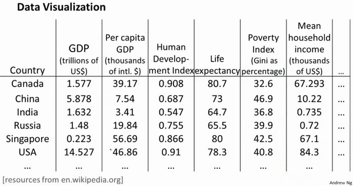

假使我们有有关于许多不同国家的数据，每一个特征向量都有50个特征（如**GDP**，人均**GDP**，平均寿命等）。如果要将这个50维的数据可视化是不可能的。使用降维的方法将其降至2维，我们便可以将其可视化了。


这样做的问题在于，降维的算法只负责减少维数，新产生的特征的意义就必须由我们自己去发现了。


### 11.2 主成分分析问题 Principal Component Analysis Problem Formulation

主成分分析(**PCA**)是最常见的降维算法：

- 在**PCA**中，我们要做的是找到一个方向向量（**Vector direction**），当我们把所有的数据都投射到该向量上时，我们希望投射平均均方误差能尽可能地小
- 方向向量是一个经过原点的向量，而投射误差是从特征向量向该方向向量作垂线的长度
- 要将$n$维数据降至$k$维，目标是找到向量$u^{(1)}$,$u^{(2)}$,...,$u^{(k)}$使得总的投射误差最小


PCA的特点：

1. 对数据进行降维的处理，同时最大程度的保持了原有数据的信息。
2. 完全无参数限制，在**PCA**的计算过程中完全不需要人为的设定参数或是根据任何经验模型对计算进行干预，最后的结果只与数据相关。
3. 这一点同时也可以看作是缺点，如果用户对观测对象有一定的先验知识，掌握了数据的一些特征，却无法通过参数化等方法对处理过程进行干预，可能会得不到预期的效果，效率也不高。


PCA与线性回归对比：

主成分分析与线性回归是两种不同的算法。主成分分析最小化的是**投射误差**（**Projected Error**），而线性回归尝试的是最小化预测误差。线性回归的目的是预测结果，而主成分分析不作任何预测。


上图中，左边的是线性回归的误差（垂直于横轴投影），右边则是主要成分分析的误差（垂直于红线投影）


### 11.3 主成分分析算法 PCA Algorithm

**PCA** 减少$n$维到$k$维：

1. 均值归一化，我们需要计算出所有特征的均值，然后令 $x_j= x_j-μ_j$。如果特征是在不同的数量级上，我们还需要将其除以标准差 $σ^2$。

2. 计算**协方差矩阵**（**covariance matrix**）$Σ$：
   $$
   \sum=\dfrac {1}{m}\sum^{n}_{i=1}\left( x^{(i)}\right) \left( x^{(i)}\right) ^{T}
   $$

3. 第三步是计算协方差矩阵$Σ$的**特征向量**$z^{(i)}$（**eigenvectors**）:

   可以利用**奇异值分解**（**singular value decomposition**）来求解


对于一个 $n×n$维度的矩阵，上式中的$U$是一个具有与数据之间最小投射误差的方向向量构成的矩阵。如果我们希望将数据从$n$维降至$k$维，我们只需要从$U$中选取前$k$个向量，获得一个$n×k$维度的矩阵，我们用$U_{reduce}$表示，然后通过如下计算获得要求的新特征向量$z^{(i)}$:
$$
z^{(i)}=U^{T}_{reduce}*x^{(i)}
$$


其中$x$是$n×1$维的，因此结果为$k×1$维度。注，我们不对方差特征进行处理。


### 11.4 选择主成分分析的数量 Choosing The Number Of Principal Components

主要成分分析是减少投射的平均均方误差：
$$
{\dfrac {1}{m}\sum^{m}_{i=1}\left\| x^{\left( i\right) }-x^{\left( i\right) }_{approx}\right\| ^{2}}
$$
训练集的方差为：
$$
\dfrac {1}{m}\sum^{m}_{i=1}\left\| x^{\left( i\right) }\right\| ^{2}
$$
我们希望在平均均方误差与训练集方差的比例尽可能小的情况下选择尽可能小的$k$值。

实际上，在选择k值得时候，通常以原本数据的方差保留值作为衡量指标：

比如如果我们希望这个比例小于1%，就意味着原本数据的方差有99%都保留下来了


在对于选择k值时，通常从$k = 1$开始，直至计算出方差保留值符合条件的，将k作为降维的数量


实际上，可以用过**奇异值分解**（**singular value decomposition**）中的S矩阵来进行替代计算：
$$
\dfrac {\dfrac {1}{m}\sum^{m}_{i=1}\left\| x^{\left( i\right) }-x^{\left( i\right) }_{approx}\right\| ^{2}}{\dfrac {1}{m}\sum^{m}_{i=1}\left\| x^{(i)}\right\| ^{2}}=1-\dfrac {\Sigma^{k}_{i=1}S_{ii}}{\Sigma^{m}_{i=1}S_{ii}}\leq 1\%
$$
可以极大的简化计算过程：
$$
\frac {\Sigma^{k}_{i=1}s_{ii}}{\Sigma^{n}_{i=1}s_{ii}}\geq0.99
$$


### 11.5 重建的压缩表示 Reconstruction from Compressed Representation

在以前的视频中，我谈论**PCA**作为压缩算法。在那里你可能需要把1000维的数据压缩100维特征，或具有三维数据压缩到一二维表示。所以，如果这是一个压缩算法，应该能回到这个压缩表示，回到你原有的高维数据的一种近似。

所以，给定的$z^{(i)}$，这可能100维，怎么回到你原来的表示$x^{(i)}$，这可能是1000维的数组？

**PCA**算法，我们可能有一个这样的样本。如图中样本$x^{(1)}$,$x^{(2)}$。我们做的是，我们把这些样本投射到图中这个一维平面。然后现在我们需要只使用一个实数，比如$z^{(1)}$，指定这些点的位置后他们被投射到这一个三维曲面。给定一个点$z^{(1)}$，我们怎么能回去这个原始的二维空间呢？$x$为2维，$z$为1维，$z=U^{T}_{reduce}x$，相反的方程为：$x_{appox}=U_{reduce}\cdot z$,$x_{appox}\approx x$。如图：


如你所知，这是一个漂亮的与原始数据相当相似。所以，这就是你从低维表示$z$回到未压缩的表示。我们得到的数据的一个之间你的原始数据 $x$，我们也把这个过程称为重建原始数据。

当我们认为试图重建从压缩表示 $x$ 的初始值。所以，给定未标记的数据集，您现在知道如何应用**PCA**，你的带高维特征$x$和映射到这的低维表示$z$。这个视频，希望你现在也知道如何采取这些低维表示$z$，映射到备份到一个近似你原有的高维数据。


### 11.6 主成分分析应用建议 Advice for Applying PCA

假使我们正在针对一张 100×100像素的图片进行某个计算机视觉的机器学习，即总共有10000 个特征。

      1. 第一步是运用主要成分分析将数据压缩至1000个特征
      2. 然后对训练集运行学习算法
      3. 在预测时，采用之前学习而来的$U_{reduce}$将输入的特征$x$转换成特征向量$z$，然后再进行预测

注：如果我们有交叉验证集合测试集，也采用对训练集学习而来的$U_{reduce}$。


==主成分分析正确应用方式：==

- 压缩数据：1.减少数据储存内存/磁盘占用量 2.减少特征数量，加速算法
- 数据可视化：通过缩减特征数，进行数据可视化 k = 2 or k = 3

错误应用：

1.用于减少过拟合现象 - 用正则化系数效果更好

2.默认算法中必须使用PCA - 实际上最好还是从原始特征开始，除非算法运行太慢或占用过大内存


## 12.异常检测 Anomaly Detection

### 12.1 问题动机 Problem Motivation

- 异常检测(**Anomaly detection**)是机器学习算法的一个常见应用。

这种算法的一个有趣之处在于：它虽然主要用于非监督学习问题，但从某些角度看，它又类似于一些监督学习问题。

给定数据集 $x^{(1)},x^{(2)},..,x^{(m)}$，我们假使数据集是正常的，我们希望知道新的数据 $x_{test}$ 是不是异常的，即这个测试数据不属于该组数据的几率如何。我们所构建的模型应该能根据该测试数据的位置告诉我们其属于一组数据的可能性 $p(x)$。


上图中，在蓝色圈内的数据属于该组数据的可能性较高，而越是偏远的数据，其属于该组数据的可能性就越低。

这种方法称为密度估计，表达如下：

$$
if \quad p(x)
\begin{cases}
< \varepsilon & anomaly \\
> =\varepsilon & normal
\end{cases}
$$

再一个例子是检测一个数据中心，特征可能包含：内存使用情况，被访问的磁盘数量，**CPU**的负载，网络的通信量等。根据这些特征可以构建一个模型，用来判断某些计算机是不是有可能出错了。


### 12.2 高斯分布算法 Gaussian Distribution Algorithm

通常如果我们认为变量 $x$ 符合高斯分布（正态分布） $x \sim N(\mu, \sigma^2)$则其概率密度函数为：
$$
p(x,\mu,\sigma^2)=\frac{1}{\sqrt{2\pi}\sigma}\exp\left(-\frac{(x-\mu)^2}{2\sigma^2}\right)
$$


异常检测算法：

1. 选择能表示异常样本的特征$x_i$
2. 对于给定的数据集 $x^{(1)},x^{(2)},...,x^{(m)}$，我们要针对每一个特征计算 $\mu$ 和 $\sigma^2$ 的估计值。

$$
\mu_j=\frac{1}{m}\sum\limits_{i=1}^{m}x_j^{(i)}
$$

$$
\sigma_j^2=\frac{1}{m}\sum\limits_{i=1}^m(x_j^{(i)}-\mu_j)^2
$$

注：机器学习中对于方差我们通常只除以$m$而非统计学中的$(m-1)$，实际应用中差距不大

3. 计算获得了平均值和方差的估计值，给定新的一个训练实例，根据模型计算 $p(x)$：

$$
p(x)=\prod\limits_{j=1}^np(x_j;\mu_j,\sigma_j^2)=\prod\limits_{j=1}^1\frac{1}{\sqrt{2\pi}\sigma_j}exp(-\frac{(x_j-\mu_j)^2}{2\sigma_j^2})
$$

当$p(x) < \varepsilon$时，为异常

下图为异常检测试例：


### 12.3 开发和评价异常检测系统 Developing and Evaluating an Anomaly Detection System

异常检测算法是一个非监督学习算法，意味着我们无法根据结果变量 $ y$ 的值来告诉我们数据是否真的是异常的。我们需要另一种方法来帮助检验算法是否有效。当我们开发一个异常检测系统时，我们从带标记（异常或正常）的数据着手，我们从其中选择一部分正常数据用于构建训练集，然后用剩下的正常数据和异常数据混合的数据构成交叉检验集和测试集。

例如：我们有10000台正常引擎的数据，有20台异常引擎的数据。 我们这样分配数据：

6000台正常引擎的数据作为训练集

2000台正常引擎和10台异常引擎的数据作为交叉检验集

2000台正常引擎和10台异常引擎的数据作为测试集

具体的评价方法如下：

1. 根据测试集数据，根据估计特征的**平均值**和方差并构建$p(x)$函数

2. 对交叉检验集，我们尝试使用不同的$\varepsilon$值作为阀值，并预测数据是否异常，根据$F1$值或者查准率与查全率的比例来选择 $\varepsilon$

3. 选出 $\varepsilon$ 后，针对测试集进行预测，计算异常检验系统的$F1$值，或者查准率与查全率之比

> 可用F1值评价异常检测系统


### 12.4 异常检测与监督学习对比 Anomaly Detection vs. Supervised Learning

之前我们构建的异常检测系统也使用了带标记的数据，与监督学习有些相似，下面的对比有助于选择采用监督学习还是异常检测：

两者比较：

| 异常检测                                                     | 监督学习                                                     |
| ------------------------------------------------------------ | ------------------------------------------------------------ |
| 非常少量的正向类（异常数据 $y=1$）, 大量的负向类（$y=0$）    | 同时有大量的正向类和负向类                                   |
| 许多不同种类的异常，非常难。根据非常 少量的正向类数据来训练算法。 | 有足够多的正向类实例，足够用于训练 算法，未来遇到的正向类实例可能与训练集中的非常近似。 |
| 未来遇到的异常可能与已掌握的异常、非常的不同。               |                                                              |
| 例如： 欺诈行为检测 生产（例如飞机引擎）检测数据中心的计算机运行状况 | 例如：邮件过滤器 天气预报 肿瘤分类                           |

希望这节课能让你明白一个学习问题的什么样的特征，能让你把这个问题当做是一个异常检测，或者是一个监督学习的问题。另外，对于很多技术公司可能会遇到的一些问题，通常来说，正样本的数量很少，甚至有时候是0，也就是说，出现了太多没见过的不同的异常类型，那么对于这些问题，通常应该使用的算法就是异常检测算法。


### 12.5 特征选择 Choosing What Features to Use

对于异常检测算法，我们使用的特征是至关重要的，下面谈谈如何选择特征：

异常检测假设特征符合高斯分布，如果数据的分布不是高斯分布，异常检测算法也能够工作，但是最好还是将数据转换成高斯分布，例如使用对数函数：$x= log(x+c)$，其中 $c$ 为非负常数； 或者 $x=x^c$，$c$为 0-1 之间的一个分数，等方法。(编者注：在**python**中，通常用`np.log1p()`函数，$log1p$就是 $log(x+1)$，可以避免出现负数结果，反向函数就是`np.expm1()`)


> 最好将异常检测的特征转换成**高斯分布**

另外：

我们通常可以通过将一些相关的特征进行组合，来获得一些新的更好的特征（异常数据的该特征值异常地大或小），例如，在检测数据中心的计算机状况的例子中，我们可以用**CPU**负载与网络通信量的比例作为一个新的特征，如果该值异常地大，便有可能意味着该服务器是陷入了一些问题中。


### 12.6 多元高斯分布 Multivariate Gaussian Distribution

假使我们有两个相关的特征，而且这两个特征的值域范围比较宽，这种情况下，一般的高斯分布模型可能不能很好地识别异常数据。其原因在于，一般的高斯分布模型尝试的是去同时抓住两个特征的偏差，因此创造出一个比较大的判定边界。

下图中是两个相关特征，洋红色的线（根据ε的不同其范围可大可小）是一般的高斯分布模型获得的判定边界，很明显绿色的**X**所代表的数据点很可能是异常值，但是其$p(x)$值却仍然在正常范围内。多元高斯分布将创建像图中蓝色曲线所示的判定边界。


在一般的高斯分布模型中，我们计算 $p(x)$ 的方法是：
通过分别计算每个特征对应的几率然后将其累乘起来，在多元高斯分布模型中，我们将构建特征的协方差矩阵，用所有的特征一起来计算 $p(x)$。

我们首先计算所有特征的平均值，然后再计算协方差矩阵：
$p(x)=\prod_{j=1}^np(x_j;\mu,\sigma_j^2)=\prod_{j=1}^n\frac{1}{\sqrt{2\pi}\sigma_j}exp(-\frac{(x_j-\mu_j)^2}{2\sigma_j^2})$

$\mu=\frac{1}{m}\sum_{i=1}^mx^{(i)}$

$\Sigma = \frac{1}{m}\sum_{i=1}^m(x^{(i)}-\mu)(x^{(i)}-\mu)^T=\frac{1}{m}(X-\mu)^T(X-\mu)$

注:其中$\mu $ 是一个向量，其每一个单元都是原特征矩阵中一行数据的均值。最后我们计算多元高斯分布的$p\left( x \right)$:
$p(x)=\frac{1}{(2\pi)^{\frac{n}{2}}|\Sigma|^{\frac{1}{2}}}exp\left(-\frac{1}{2}(x-\mu)^T\Sigma^{-1}(x-\mu)\right)$
其中：

$|\Sigma|$是定矩阵，$\Sigma^{-1}$ 是逆矩阵，下面我们来看看协方差矩阵是如何影响模型的：


上图是5个不同的模型，从左往右依次分析：

1. 是一个一般的高斯分布模型
2. 通过协方差矩阵，令特征1拥有较小的偏差，同时保持特征2的偏差
3. 通过协方差矩阵，令特征2拥有较大的偏差，同时保持特征1的偏差
4. 通过协方差矩阵，在不改变两个特征的原有偏差的基础上，增加两者之间的正相关性
5. 通过协方差矩阵，在不改变两个特征的原有偏差的基础上，增加两者之间的负相关性

> 另外改变$\mu$的值会移动该模型


### 12.7 使用多元高斯分布进行异常检测 Anomaly Detection using the Multivariate Gaussian Distribution

多元高斯分布：

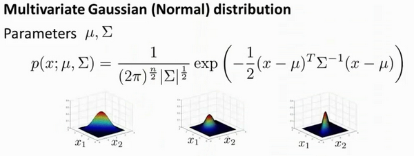

分布有两个参数， $\mu$ 和 $\Sigma$。其中$\mu$这一个$n$维向量和 $\Sigma$ 的协方差矩阵，是一种$n\times n$的矩阵

使用多元高斯分布进行异常检测算法：


首先，在训练集中计算$\mu$和$\Sigma$，然后对于新的$x$计算$p(x)$然后与$\varepsilon$对比


如图，该分布在中央最多，越到外面的圈的范围越小


原高斯分布模型和多元高斯分布模型的比较：


| 原高斯分布模型                                               | 多元高斯分布模型                                             |
| ------------------------------------------------------------ | ------------------------------------------------------------ |
| 不能捕捉特征之间的相关性 但可以通过将特征进行组合的方法来解决 | 自动捕捉特征之间的相关性                                     |
| 计算代价低，能适应大规模的特征                               | 计算代价较高 训练集较小时也同样适用                          |
|                                                              | 必须要有 $m>n$，不然的话协方差矩阵$\Sigma$不可逆的，通常需要 $m>10n$ 另外特征冗余也会导致协方差矩阵不可逆 |

原高斯分布模型被广泛使用着，如果特征之间在某种程度上存在相互关联的情况，我们可以通过构造新特征的方法来捕捉这些相关性。

如果训练集不是太大，并且没有太多的特征，我们可以使用多元高斯分布模型。


## 13.推荐系统 Recommender Systems

### 13.1 基于内容的推荐系统 Content Based Recommendations

在一个基于内容的推荐系统算法中，我们假设对于我们希望推荐的东西有一些数据，这些数据是有关这些东西的特征。

在我们的例子中，我们可以假设每部电影都有两个特征，如$x_1$代表电影的浪漫程度，$x_2$ 代表电影的动作程度。


则每部电影都有一个特征向量，如$x^{(1)}$是第一部电影的特征向量为[0.9 0]。

下面我们要基于这些特征来构建一个推荐系统算法。
假设我们采用线性回归模型，我们可以针对每一个用户都训练一个线性回归模型，如${{\theta }^{(1)}}$是第一个用户的模型的参数。
于是，我们有：

$\theta^{(j)}$用户 $j$ 的参数向量

$x^{(i)}$电影 $i$ 的特征向量

对于用户 $j$ 和电影 $i$，我们预测评分为：$(\theta^{(j)})^T x^{(i)}$

代价函数

针对用户 $j$，该线性回归模型的代价为预测误差的平方和，加上正则化项：
$$
\min_{\theta (j)}\frac{1}{2}\sum_{i:r(i,j)=1}\left((\theta^{(j)})^Tx^{(i)}-y^{(i,j)}\right)^2+\frac{\lambda}{2}\left(\theta_{k}^{(j)}\right)^2
$$


其中 $i:r(i,j)$表示我们只计算那些用户 $j$ 评过分的电影。在一般的线性回归模型中，误差项和正则项应该都是乘以$1/2m$，在这里我们将$m$去掉。并且我们不对方差项$\theta_0$进行正则化处理。

上面的代价函数只是针对一个用户的，为了学习所有用户，我们将所有用户的代价函数求和：
$$
\min_{\theta^{(1)},...,\theta^{(n_u)}} \frac{1}{2}\sum_{j=1}^{n_u}\sum_{i:r(i,j)=1}\left((\theta^{(j)})^Tx^{(i)}-y^{(i,j)}\right)^2+\frac{\lambda}{2}\sum_{j=1}^{n_u}\sum_{k=1}^{n}(\theta_k^{(j)})^2
$$
如果我们要用梯度下降法来求解最优解，我们计算代价函数的偏导数后得到梯度下降的更新公式为：

$$
\theta_k^{(j)}:=\theta_k^{(j)}-\alpha\sum_{i:r(i,j)=1}((\theta^{(j)})^Tx^{(i)}-y^{(i,j)})x_{k}^{(i)} \quad (\text{for} \, k = 0)
$$

$$
\theta_k^{(j)}:=\theta_k^{(j)}-\alpha\left(\sum_{i:r(i,j)=1}((\theta^{(j)})^Tx^{(i)}-y^{(i,j)})x_{k}^{(i)}+\lambda\theta_k^{(j)}\right) \quad (\text{for} \, k\neq 0)
$$

> 类似于线性回归问题


### 13.2 协同过滤算法 Collaborative Filtering Algorithm

如果有电影的特征，可以对用户的参数进行预测；有用户的参数也可对电影特征做预测。

但是如果我们既没有用户的参数，也没有电影的特征，便可用协同过滤算法同时学习这两者。


协同过滤算法使用步骤如下：

1. 初始 $x^{(1)},x^{(1)},...x^{(nm)},\ \theta^{(1)},\theta^{(2)},...,\theta^{(n_u)}$为一些随机小值

2. 使用梯度下降算法最小化代价函数

3. 在训练完算法后，我们预测$(\theta^{(j)})^Tx^{(i)}$为用户 $j$ 给电影 $i$ 的评分


如何找到相关影片：


现在既然你已经对特征参数向量进行了学习，那么我们就会有一个很方便的方法来度量两部电影之间的相似性。例如说：电影 $i$ 有一个特征向量$x^{(i)}$，你是否能找到一部不同的电影 $j$，保证两部电影的特征向量之间的距离$x^{(i)}$和$x^{(j)}$很小，那就能很有力地表明电影$i$和电影 $j$ 在某种程度上有相似，至少在某种意义上，某些人喜欢电影 $i$，或许更有可能也对电影 $j$ 感兴趣。总结一下，当用户在看某部电影 $i$ 的时候，如果你想找5部与电影非常相似的电影，为了能给用户推荐5部新电影，你需要做的是找出电影 $j$，在这些不同的电影中与我们要找的电影 $i$ 的距离最小，这样你就能给你的用户推荐几部不同的电影了。

例如，如果一位用户正在观看电影 $x^{(i)}$，我们可以寻找另一部电影$x^{(j)}$，依据两部电影的特征向量之间的距离$\left\| {{x}^{(i)}}-{{x}^{(j)}} \right\|$的大小。


### 13.3 推行工作上的细节：均值归一化 Implementational Detail\_ Mean Normalization

让我们来看下面的用户评分数据：


如果我们新增一个用户 **Eve**，并且 **Eve** 没有为任何电影评分，那么我们以什么为依据为**Eve**推荐电影呢？

我们首先需要对结果 $Y $矩阵进行均值归一化处理，将每一个用户对某一部电影的评分减去所有用户对该电影评分的平均值：


然后我们利用这个新的 $Y$ 矩阵来训练算法。

如果我们要用新训练出的算法来预测评分，则需要将平均值重新加回去，预测$(\theta^{(j)})^T x^{(i)}+\mu_i$。

>对于新用户**Eve**，我们的新模型会认为她给每部电影的评分都是该电影的平均分。


## 14.大规模机器学习 Learning With Large Datasets

### 14.1 大型数据集的学习

首先应该做的事是去检查一个这么大规模的训练集是否真的必要，也许我们只用1000个训练集也能获得较好的效果，我们可以绘制学习曲线来帮助判断。


1.在高偏差/欠拟合的情况下，增加数据到训练集不一定能有帮助。

2.在高方差/过拟合的情况下，增加更多数据到训练集可能可以提高算法效果。


### 14.2 随机梯度下降算法 Stochastic Gradient Descent

随机梯度下降算法，在一次迭代计算中只需考虑一项：


算法优缺点：

1. 相比批量梯度下降算法，其速度快
2. 算法问题在于：并不是每一步都朝着正确的方向走，固定的学习率$\alpha$下，最终算法会在局部最小值附近徘徊

> 解决办法：
>
> 让学习率$\alpha$随迭代次数的上升而下降，这样会使算法收敛在更靠近局部最小值的位置


### 14.3 小批量梯度下降 Mini-Batch Gradient Descent

小批量梯度下降算法是介于批量梯度下降算法和随机梯度下降算法之间的算法，每计算常数$b$次训练实例，便更新一次参数 ${{\theta }}$ 


通常我们会令 $b$ 在 2-100 之间。这样做的好处在于，我们可以用向量化的方式来循环 $b$个训练实例，如果我们用的线性代数函数库比较好，能够支持平行处理，那么算法的总体表现将不受影响（与随机梯度下降相同）。


小批量梯度下降算法相比于批量梯度下降算法速度更快，当选择合适的b值后，有时甚至比随机梯度下降SGD更快


### 14.4 随机梯度下降的收敛 Stochastic Gradient Descent Convergence

现在我们介绍随机梯度下降算法的调试，以及学习率 $α$ 的选取。

在批量梯度下降中，我们可以令代价函数$J$为迭代次数的函数，绘制图表，根据图表来判断梯度下降是否收敛。但是，在大规模的训练集的情况下，计算代价过大。

在随机梯度下降中，我们在每一次更新 ${{\theta }}$ 之前都计算一次代价，然后每$x$次迭代后，求出这$x$次对训练实例计算代价的平均值，然后绘制这些平均值与$x$次迭代的次数之间的函数图表。


根据绘制的学习曲线来进行参数调试：


如图所示：

1. 选取更小的学习率也许会让代价函数收敛到更小值
2. 采用更多的迭代次数来作平均会让曲线更加光滑，并且更容易看到曲线变化的趋势
3. 当代价越来越大时，需要使用更小的学习率$\alpha$


### 14.5 在线学习 Online Learning

在线学习指的是实时更新学习，而并不是使用一个固定的数据集，如下例：


在运输货物中，输入特征$x$定义为：1.货物出发地及目的地 2.我们提供的报价，输出特征$y$定义为用户是否接受订单，每当一个订单完成后，对算法参数进行更新，以此来提出最优的报价。

> 在线学习的最大优点在于：==适应变化== （Adopt Changing）


### 14.6 多核计算与数据并行 Map Reduce and Data Parallelism

在大规模的机器学习中，如果有数据集在单台电脑上无法完成或运行速度很慢，可以进行并行计算


 将数据集均匀分配后发送给不同的电脑，最终累加起来：


同样的，如果电脑CPU有很多核心，也可以在不同的核心上计算：


目前，很多的线性代数库已经可以自动分配给一台电脑的多个核心进行并行计算，这也就是将数据向量化能大幅提升计算速度的原因

具体而言，如果任何学习算法能够表达为，对训练集的函数的求和，那么便能将这个任务分配给多台计算机（或者同一台计算机的不同**CPU** 核心），以达到加速处理的目的。


## 15.应用实例：图片文字识别 Application Example: Photo OCR

### 15.1 问题描述与流程制定  Problem Description and Pipeline

图像文字识别应用所作的事是，从一张给定的图片中识别文字。这比从一份扫描文档中识别文字要复杂的多。


为了完成这样的工作，需要采取如下步骤：

1. 文字侦测（**Text detection**）——将图片上的文字与其他环境对象分离开来

2. 字符切分（**Character segmentation**）——将文字分割成一个个单一的字符

3. 字符分类（**Character classification**）——确定每一个字符是什么
   可以用任务流程图来表达这个问题，每一项任务可以由一个单独的小队来负责解决：


在图形检测中，通常用到滑动窗口进行识别，根据上述的流程图，进行图片文字识别


### 15.2 获取大量数据和人工数据

在高方差/过拟合的情况下，增加更多数据到训练集可能可以提高算法效果。

问题在于，我们怎样获得数据，数据不总是可以直接获得的，我们可以人工地创造一些数据

以我们的文字识别应用为例，我们可以字体网站下载各种字体，然后利用这些不同的字体配上各种不同的随机背景图片创造出一些用于训练的实例，这让我们能够获得一个无限大的训练集。这是从零开始创造实例。

另一种方法是，利用已有的数据，然后对其进行修改，例如将已有的字符图片进行一些扭曲、旋转、模糊处理。只要我们认为实际数据有可能和经过这样处理后的数据类似，我们便可以用这样的方法来创造大量的数据。

有关获得更多数据的几种方法：

    1. 人工数据合成
    2. 手动收集、标记数据
    3. 众包 - 包给外部公司，进行收集标记处理


### 15.3 上限分析 Ceiling Analysis - What Part of the Pipeline to Work on Next

在机器学习的应用中，我们通常需要通过几个步骤才能进行最终的预测，我们如何能够知道哪一部分最值得我们花时间和精力去改善呢？这个问题可以通过上限分析来回答。

回到我们的文字识别应用中，我们的流程图如下：


流程图中每一部分的输出都是下一部分的输入，上限分析中，我们选取一部分，手工提供100%正确的输出结果，然后看应用的整体效果提升了多少。

1. 假使我们的例子中总体效果为72%的正确率
2. 如果我们令文字侦测部分输出的结果100%正确，发现系统的总体效果从72%提高到了89%。这意味着我们很可能会希望投入时间精力来提高我们的文字侦测部分
3. 接着我们手动选择数据，让字符切分输出的结果100%正确，发现系统的总体效果只提升了1%，这意味着，我们的字符切分部分可能已经足够好了。
4. 最后我们手工选择数据，让字符分类输出的结果100%正确，系统的总体效果又提升了10%，这意味着我们可能也会应该投入更多的时间和精力来提高应用的总体表现


> 在机器学习系统中运用上限分析可以避免无效的努力


## 16.总结 Conclusion

在《机器学习》课程中学到了什么，我们对其作一个回顾：


1. 监督学习：线性回归，逻辑回归，神经网络，SVM支持向量机
2. 非监督学习：K均值算法，主成分分析PCA，异常检测
3. 特殊应用：推荐系统，大型机器学习系统
4. 搭建更好机器学习系统的实用建议：

- 考虑偏差及方差，正则化
- 决定下一步要做什么：机器学习评价法，学习曲线，误差分析，上限分析


Thank you! ☺️ 

**Andew Ng**

